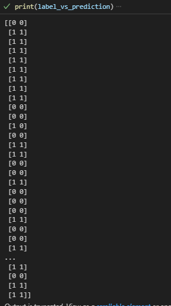

# Concrete crack image calssification project
## Project detail
There are several types of common concrete cracks namely hairline cracks which usually develop in concrete foundation as the concrete cures, shrinkage cracks which occur while the concrete is curing, settlement cracks which happen when part of concrete sinks or when the ground underneath the slab isn’t compacted properly as well as structural cracks which form due to incorrect design. Concrete cracks may endanger the safety and durability of a building if not being identified quickly and left untreated. The project is designed to perform image classification to classify concretes with or without cracks.
The data used from the project is first seperated into a train and test folder. The test dataset then used to also create a validation dataset.
All the dataset are then converted into Prefetch dataset. The data augmentation model and the input preprocessing layer are created. 
The transfer learning is then applied. the project is using the MobileNetV3Large model for the transfer learning.
the model is compiled and evaluated before undergoes the training.
EarlyStopping is applied to avoid overfitting.
The model is then evaluated and deployed and the prediction is compared with the label. 
The output can be viewed by the label_vs_prediction array to compare the if the precition is correct.
## Guide
Inside the github the model file is provided. You may use it to perform your project. 
In the project, the user needs to vonvert the data into a prefetch dataset before applying it to the model.
Then, the dataset can be used to predict the crack in the concrete.
## Output of the project
- This is the model architecture 

- This is the model evaluation before training

- This model evaluation after training

This is the label vs pred array when making some prediction with the test dataset.

## Credits for the dataset
- https://data.mendeley.com/datasets/5y9wdsg2zt/2